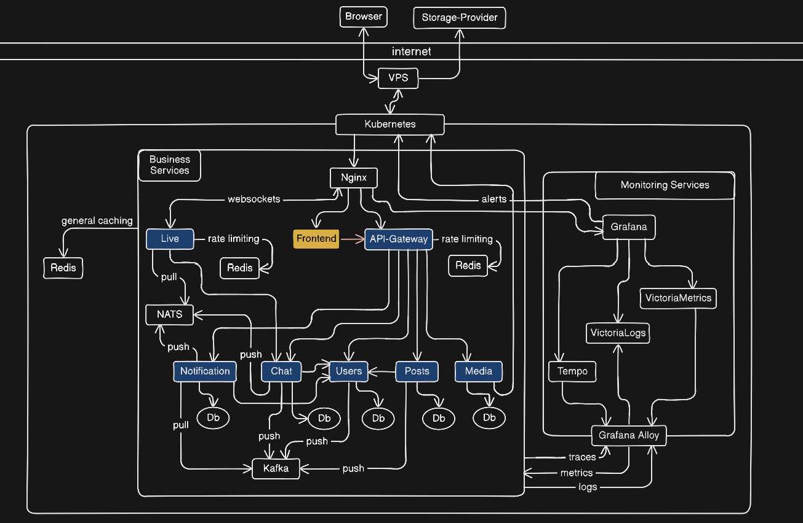

# Social Network

## Overview

This project is a **cloud-native microservices backend** built in **Go**, designed with scalability, observability, and maintainability in mind. It demonstrates modern backend engineering practices including **gRPC communication**, **replicated services and databases**, **messaging**, **Kubernetes orchestration**, and **metrics-driven design**.

The system was developed as part of a **Zone01 team project** with a focus on robust service design and future scalability.

---

## Features

* **Microservices architecture**

  * Services communicate via **gRPC**
  * Clean, interface-driven design to support future scaling
  * Decoupled modules for maintainability

* **Databases**

  * **PostgreSQL (Cloud Native PG operator)** with replication
  * **Redis with Sentinel** for caching and failover

* **Messaging / Event Streaming**

  * **NATS** for lightweight pub/sub communication
  * **Kafka** for event-driven workflows

* **Observability & Monitoring**

  * **VictoriaMetrics** for metrics
  * **Grafana dashboards** for visualization
  * **Tracing** and logs for debugging and performance analysis

* **Security**

  * JWT-based authentication with expiration
  * Encrypted IDs exposed to front-end
  * Input validation using custom typed validators
  * Rate limiting and paginated requests

* **Cloud-Native Deployment**

  * Fully containerized using **Docker**
  * Deployed and orchestrated with **Kubernetes**
  * Automatic handling of database secrets via K8s secrets
  * Health checks, readiness probes, and failover support

---

## Architecture

* Services are designed for **horizontal scaling** and **stateless operations** wherever possible.
* Database and messaging systems are **replicated** for resilience.
* Observability stack collects **metrics, logs, and traces** for performance and debugging.

---

## Getting Started

### Prerequisites

* Go 1.25.5+
* Docker & Docker Compose
* Kubernetes cluster (Colima / Minikube / kind / cloud provider)

### Deployment Steps

1. Install cloud native operator
2. Build docker base for golang and cloudnative image for Postgress
3. Build Docker images for services
4. Load images to K8s cluster (not needed on Colima)
5. Run deployment in this order using make commands.
	- make apply-kafka (need to first create name space if doing manual run. Name space creation is included in make commands)
	- make apply-namespace
	- make apply-pvc
	- make apply-configs
	- make apply-monitoring
	- make apply-db1  
    - make apply-db2
        - **Wait for db pods and all replicas to run**
    - make run-migrations 
	- make apply-apps   
        - **Wait for storage pod to run**
    - make apply-cors
    - make port-forward

    *Make commands run `kubectl apply -f` recursively on K8s dir for each stage selector*
    
    #### Ports exposed
    - Frontend -> localhost:3000 
    - Grafana -> localhost:3001
        - user: social
        - password: wearecool
    - victoria logs -> localhost:9428

---

## Observability

* **Metrics**: Latency, throughput, error rates (VictoriaMetrics)
* **Tracing**: gRPC call traces across services
* **Logging**: Structured logs captured per service

This allows **data-driven improvements** and performance optimization.

---

## Security Considerations

* JWT authentication with expiration
* Input validation for all endpoints
* Rate limiting for API requests
* Secrets are stored securely in Kubernetes secrets
* Services insulated via gRPC endpoints

---

## Future Improvements

* CI/CD pipelines for automatic builds and deployments
* Enhanced JWT rotation and refresh tokens
* Multi-region deployments for high availability
* Load testing and performance tuning using pprof

---

## Team

Developed by

- Alexis Gioldaseas
- Katerina Vamvasaki
- Ypatios Chaniotakos
- Vagelis Stefanopoulos
- Magnus Edvall

as a **cloud-native Go microservices project**.

---

## License

[MIT License](LICENSE)

